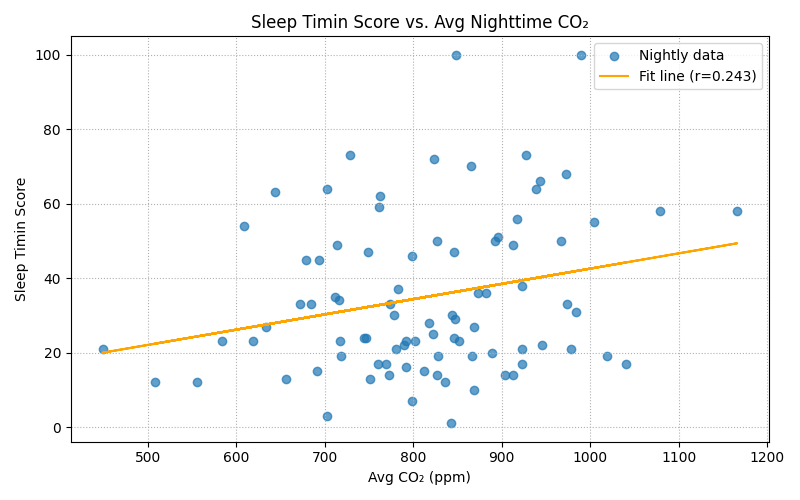

## The Relationship Between Indoor CO₂ Levels and Sleep Quality

This project investigates the relationship between indoor carbon dioxide (CO₂) concentration during sleep and various sleep metrics as measured by the Oura ring. Elevated CO₂ levels are known to affect cognitive performance and alertness; this study explores whether similar physiological effects may influence sleep quality in a home setting.

**Research Hypothesis:**

> Elevated indoor CO₂ levels during sleep are statistically associated with measurable changes in sleep quality, as recorded by Oura metrics.

Preliminary analysis supports this hypothesis, with statistically significant correlations observed—especially with REM sleep duration, resting heart rate, and overall sleep score.

---

## 🎯 Research Objective

To determine whether indoor CO₂ levels during sleep correlate with Oura sleep metrics, including REM duration, sleep efficiency, and resting heart rate, among others.

## 🧰 Devices Used

<table>
  <tr>
    <td width="50%" valign="top">
      <div align="center">
        
      </div>
      <div align="left">
        <strong>M5Stack AirQ</strong><br/>
        <em>Compact air quality monitor with integrated CO₂ and environmental sensors.</em>
        <ul>
          <li><strong>Sensors:</strong>
            <ul>
              <li><strong><a href="https://sensirion.com/products/catalog/SCD40" target="_blank">SCD40 (CO₂ sensor)</a></strong> – Compact & cost-effective photoacoustic NDIR sensor
                <ul>
                  <li>Accuracy: ±(50 ppm + 5% of measured value) from 400–2000 ppm</li>
                  <li>Built-in humidity and temperature compensation (via SHT4x)</li>
                </ul>
              </li>
              <li><strong><a href="https://sensirion.com/products/catalog/SEN55" target="_blank">SEN55 Multi Sensor Node</a></strong> – Multi-parameter air quality module
                <ul>
                  <li>Measures PM1.0–PM10, VOCs, NOx, temperature, and humidity</li>
                </ul>
              </li>
            </ul>
          </li>
          <li><strong>Controller:</strong> ESP32-S3 (StampS3)</li>
          <li><a href="https://shop.m5stack.com/products/air-quality-kit-w-m5stamps3-sen55-scd40" target="_blank">~112,50€ shipped to Finland</a></li>
        </ul>
      </div>
    </td>
    <td width="50%" valign="top">
      <div align="center">
        
      </div>
<div align="left">
  <strong>Oura Ring Generation 3</strong><br/>
  <em>Smart ring for continuous health and sleep tracking.</em>
  <ul>
    <li><strong>Sensors:</strong>
      <ul>
        <li>Infrared photoplethysmography (PPG) for heart rate and respiratory rate</li>
        <li>Red and green LEDs for SpO₂ and daytime heart rate monitoring</li>
        <li>Negative temperature coefficient (NTC) thermistor
          <ul>
            <li>Detects skin temperature changes as small as 0.13 °C</li>
          </ul>
        </li>
        <li>3D accelerometer for movement and sleep stage detection</li>
      </ul>
    </li>
    <li><strong>Tracked Metrics:</strong> Sleep stages, HR, HRV, SpO₂, temperature trends, activity</li>
    <li><a href="https://ouraring.com/" target="_blank">~220€ View Product</a></li>
  </ul>
</div>

  </tr>
</table>

## 🧪 Methodology

### 1. CO₂ Data Collection

- Air quality data was collected into self-hosted **Home Assistant** running on a Raspberry Pi.
- The **M5Stack AirQ** device runs a custom **ESPHome configuration** that:
  - Automatically connects to the local Wi-Fi network
  - Streams CO₂ readings directly to Home Assistant
- The full configuration used for the AirQ device is included in this repository:  
  [`home_assistant_config/airq_config.yaml`](home_assistant_config/airq_config.yaml)
- During the 6 months of data collection, **sensor intervals varied between 1 hour and 1 minute**.
- Home Assistant logs the sensor values. Possible to **export historical CO₂ data in CSV format** for further analysis.

- [http://homeassistant.local:8123/history?entity_id=sensor.lounge_airq_co2&start_date=2024-05-31T21%3A00%3A00.000Z&end_date=2025-05-17T15%3A00%3A00.000Z)](http://homeassistant.local:8123/history?entity_id=sensor.lounge_airq_co2&start_date=2024-05-31T21%3A00%3A00.000Z&end_date=2025-05-17T15%3A00%3A00.000Z)

### 2. Sleep Quality Data

- Exported manually from [Oura Cloud Trends](https://cloud.ouraring.com/trends).
- Contains nightly sleep metrics including:

  - Total Sleep Duration
  - REM Sleep Duration
  - Lowest Resting Heart Rate
  - Sleep Efficiency
  - Deep Sleep Score
  - Respiratory Rate

### 3. Data Processing Workflow

- CO₂ data filtered for the configured sleep window (22:00–07:00).
- For each night:

  - Compute average and maximum CO₂ values
  - Align timestamp with Oura morning-based sleep end date

- Datasets merged by night; inconsistent rows dropped

### 4. Analysis Techniques

- Automated scan of **all numeric Oura sleep metrics**
- Pearson correlation, linear regression (slope, r, p-value)
- Results sorted by absolute r-value (|r|) for interpretability
- Visual plots generated using `matplotlib`
- Implemented in `pandas`, `matplotlib`, and `scipy.stats`

---

## 📈 Preliminary Findings

Based on approximately 100 matched nights, elevated CO₂ levels:

- **Negatively correlate** with:

  - REM Sleep Duration
  - Total Sleep Score
  - Sleep Efficiency

- **Positively correlate** with:

  - Resting Heart Rate
  - Respiratory Rate

---

## 📂 Repository Structure

```
.
├── config/
│   └── airq_sensor.yaml         # ESPHome configuration for the sensor
├── data/
│   ├── co2_history.csv          # Exported CO₂ data
│   └── oura_trends.csv          # Exported Oura sleep data
├── scripts/
│   ├── auto_analyze_co2_sleep.py # Analysis script
│   ├── clean_co2_csv.py            # Removing rows with non-numeric, no decimals
│   └── verify_data.py            # Data validation utility
├── docs/
│   └── plots/                   # Generated visualizations
└── README.md
```

---

## 🧾 Data File Descriptions

### `co2_history.csv`

Exported from Home Assistant history API:

```csv
entity_id,state,last_changed
sensor.lounge_airq_co2,646.57,2024-09-17T11:00:00.000Z
sensor.lounge_airq_co2,638.70,2024-09-17T12:00:00.000Z
sensor.lounge_airq_co2,790.70,2024-09-17T13:00:00.000Z
```

**Notes:**

- Sampling interval varies (1–60s)
- Some timestamps may be missing or malformed
- Data cleaning scripts remove non-numeric values

### `oura_trends.csv`

Exported from [Oura Cloud Trends](https://cloud.ouraring.com/trends):

```csv
date,Total Sleep Score,REM Sleep Duration,Lowest Resting Heart Rate,Awake Time,...
2023-09-17,90,5430,44,187,...
2023-09-18,85,5000,45,220,...
```

**Notes:**

- One row per night
- Data filtered to include only valid entries
- Nights may be missing due to sync issues

---

## ⚠️ Data Quality Considerations

- CO₂ and Oura timestamps are aligned using a `night_date` logic
- Sampling density of CO₂ values may vary across nights
- Partial/missing data is excluded from analysis pipeline
- Analysis includes fallback aggregation and overlap filtering

---

## 🛠 Installation & Setup

Clone the repo and install dependencies:

```bash
git clone https://github.com/yourusername/co2-sleep-quality.git
cd co2-sleep-quality
pip install -r requirements.txt
```

Python 3.9+ is required.

---

## 💡 Usage Examples

Run the analysis:

```bash
python scripts/auto_analyze_co2_sleep.py --co2 data/co2_history.csv --oura data/oura_trends.csv
```

**Example Output:**

| Metric             | Pearson r | p-value | Slope         |
| ------------------ | --------- | ------- | ------------- |
| REM Sleep Duration | -0.52     | 0.001   | -0.45 min/ppm |
| Sleep Score        | -0.48     | 0.003   | -0.32 pts/ppm |
| Resting Heart Rate | 0.60      | 0.0001  | 0.12 bpm/ppm  |

## 📊 Visuals & Badges


